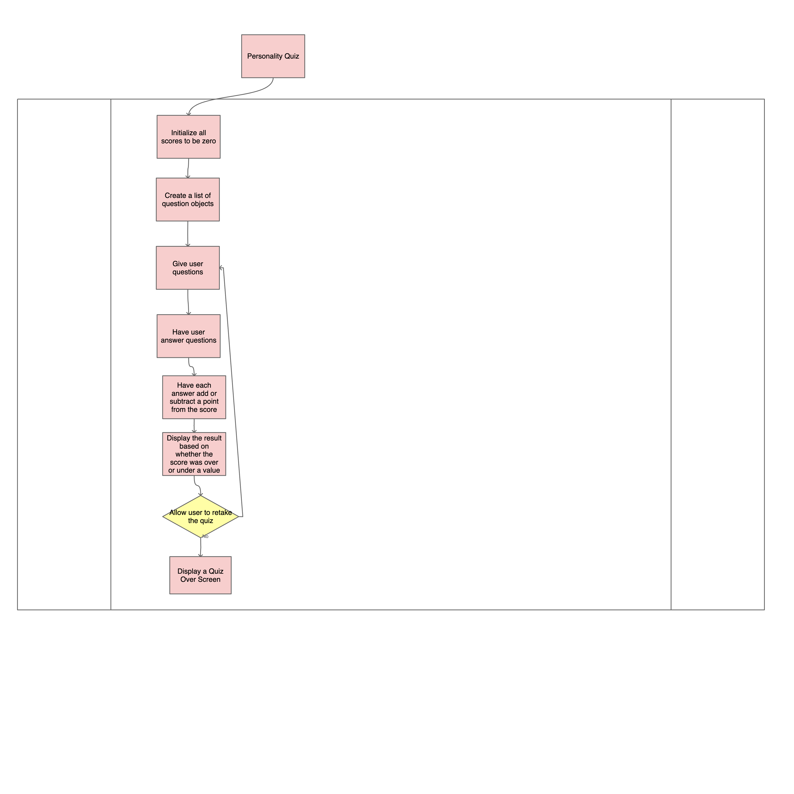

# PersonalityQuiz

## Description:
#### This personality quiz will determine what super power you have. Whether you have the ability to travel through time or the ability to travel through space!

## OverView:
#### The ultimate goal of the Personality Quiz is to entertain the user with the wonders of superpowers. The Personality Quiz functions by giving questions to the user and receiving an answer. Ultimately, the quiz ends by giving the user the results of their quiz.

## High Level Design:
#### 1. Initializes score to zero
#### 2. Creates a list of questions and answers (each answered question will either add or subtract a point from the score)
#### 3. Goes through the given questions and makes the user answer the given questions, adding and subtracting points as required.
#### 4. Once all questions have been answered, scores under zero will return a result and scores equal to or above zero will return a different result.
#### 5. Finally The user is asked if they want to redo the quiz. If they select "yes" then the user will loop through the questions again and if they select "no" then the user will be given a "quiz over" screen.

### FlowChart:

## Methods and Classes:
#### The three methods I have chosen are:
#### - static int AskQuestion(Question)
#### - static int GetValidAnswer(List<string> answers);
#### - static string GetResult(List<int> scores, List<string> results);

### Question Class:
#### - String Question
#### - List <string> Answer
